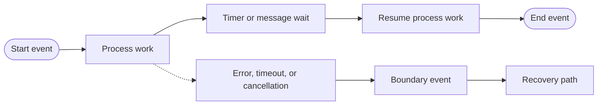

# Events

Events represent something that happens during a process lifecycle. They mark where execution begins, waits, reacts, or ends. Unlike tasks, events usually do not represent work performed by a person or service.

| Event | Meaning |
| --- | --- |
| Start Event | Begins an instance through an explicit start request |
| Message Start | Begins an instance when a named message arrives |
| End Event | Completes the current process path |
| Timer Event | Pauses execution until a configured time or duration |
| Message Catch | Waits for a correlated message |
| Message Throw | Emits a message from the process |
| Boundary Event | Reacts to an error, message, or timeout attached to active work |

Boundary events define exception or interruption paths without mixing them into the main success path. An error boundary can recover from task failure, a timer boundary can model an SLA escalation, and a message boundary can react to cancellation.

Choose event names that describe business meaning, not implementation detail. Make waiting events visible to operators and define timeout behavior whenever waiting forever would be unacceptable. See the [Modeler event components](../platform/modeler.md#flow-events).
