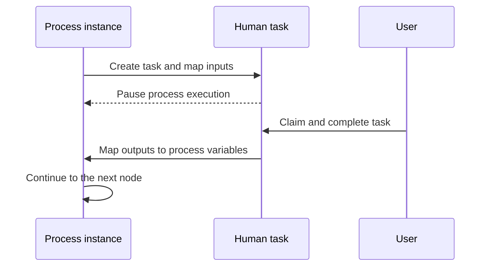

# Human Tasks

A Human Task represents work that requires a person. When execution reaches it, Easy BPM creates a task in the Task Portal and pauses the process instance until the work is completed.

A task can be assigned directly to a user or offered to candidate users or groups. A candidate claims shared work before completing it. A form can present context and collect a decision or additional information.

Input mappings copy process variables into the task context. Output mappings copy submitted task values back into the process before execution continues.

Use a Human Task for judgment, accountability, review, or manual data entry. Prefer an automated task when the work can be performed reliably by a system.

Give tasks action-oriented names, assign clear ownership, expose only necessary data, and define escalation or timeout behavior for time-sensitive work. See [User Tasks](../guides/user-tasks.md), [Forms](../guides/forms.md), and the [Task Portal](../platform/task-portal.md).
