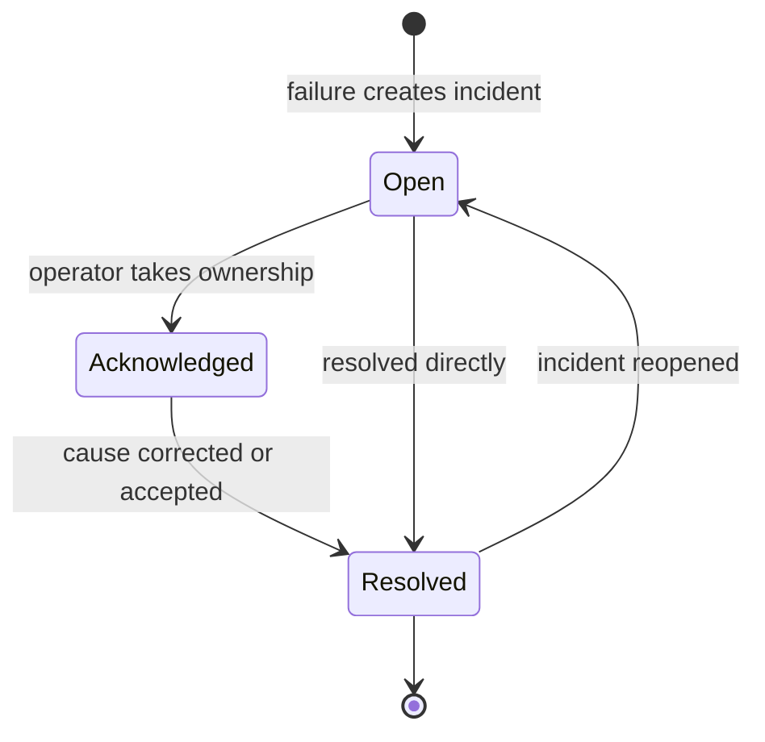

# Incidents

An incident is an operational record created when Easy BPM cannot continue normally or when a failure needs attention. It is not the process itself; it records a problem affecting a process instance and supports investigation and recovery.

Incidents can originate from the process engine, asynchronous worker, Code Task, AI Task, or message handling.

Acknowledging means an operator owns the investigation; it does not mean the cause is fixed. Resolution should state what changed. Retry only after correcting the cause or confirming the operation is safe to repeat.

A safe response is to inspect the related instance and timeline, identify the failed node and data, correct the underlying condition, evaluate duplicate side effects, retry when supported, and record the resolution.

See [Operations](../platform/operations.md) and the [Incidents API](../api/incidents.md).
