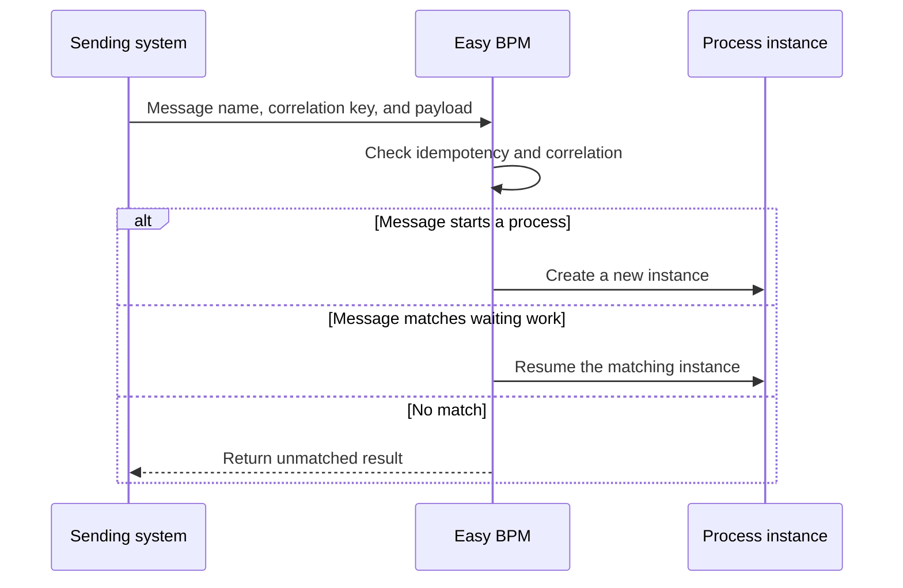

# Messages

A message is a named business signal exchanged asynchronously between a process and another participant. Examples include `OrderReceived`, `PaymentConfirmed`, and `CancellationRequested`.

Messages can start a new instance, resume a waiting instance, be emitted by a process, or interrupt active work through a boundary event.

| Pattern | Purpose |
| --- | --- |
| Message Start | Create an instance when a business event arrives |
| Intermediate Catch | Wait until a matching message arrives |
| Intermediate Throw | Emit a message from a running instance |
| Message Boundary | Interrupt or redirect active work |

Correlation connects an incoming message to the correct instance. Use a stable business value shared by both systems, such as an order ID or claim ID.

Idempotency protects against duplicate delivery. When retrying the same external event, the sender should reuse its message ID or idempotency key so the process is not started or resumed twice.

Use messages when the sender and receiver operate independently. Use an API Task when the process must make a direct HTTP request and wait for its result. See [Message Events](../guides/message-events.md).
