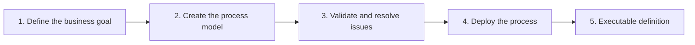

# Process

A process is a reusable definition of work. It connects events, tasks, decisions, and end states into a flow that people and systems can execute consistently.

For example, an expense approval process can receive a request, ask a manager for a decision, notify finance, and finish. The definition answers:

- What starts and completes the work?
- Which steps are performed by people or systems?
- What information moves between steps?
- Which conditions select the next path?
- What happens when work fails or takes too long?

## Creating a process

In the Modeler, an author arranges BPMN components, connects them with sequence flows, configures their properties, validates the model, and deploys it. Deployment stores an executable process definition in Easy BPM.

Each process has a stable key and can have multiple versions. Deploying a revised definition creates a new version without deleting the history of earlier executions.

Start with the business outcome and responsibilities. Add technical details only after the main path and important exception paths are clear. Continue with [Process Instances](./process-instances.md), or use [Create a Process](../guides/create-process.md) when you are ready to build.
