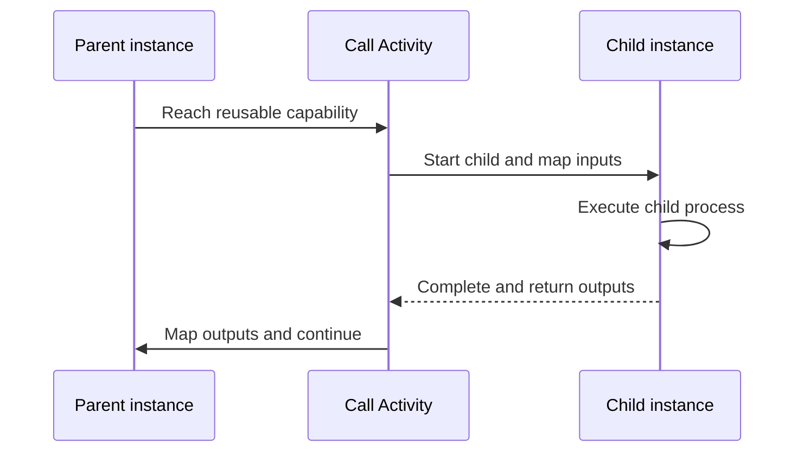

# Subprocesses

A subprocess is a reusable process invoked from another process through a Call Activity. It gives a distinct business capability its own model, versions, instances, variables, and operational history.

Examples include identity verification, finance review, document validation, or customer notification. The parent process passes selected inputs to the child and maps selected outputs back after completion.

Use a subprocess when the capability is reused, owned separately, or easier to understand and operate as an independent lifecycle. Do not split a process only to reduce diagram size if the child has no meaningful responsibility of its own.

Prefer explicit input and output mappings. They make the boundary clear and prevent accidental coupling between parent and child variables. Decide how child failures should affect the parent and add an error boundary when the parent has a meaningful recovery path.

See [Call Activities](../guides/call-activities.md) for configuration and runtime relationships.
