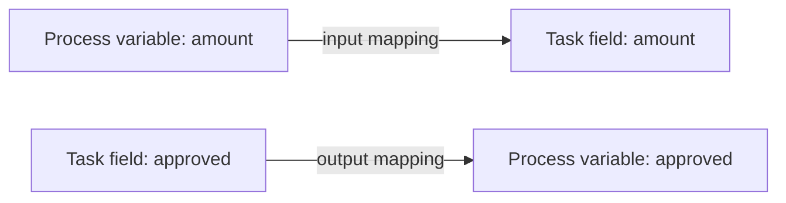

# Variables

Variables carry business data through a process instance. They let one step use information produced by an earlier step and give gateways, forms, tasks, messages, and subprocesses a shared execution context.

For an expense approval, variables might include:

| Variable | Example value | Purpose |
| --- | --- | --- |
| `requestId` | `EXP-1042` | Stable business reference |
| `amount` | `1250.00` | Value being approved |
| `requester` | `ana@example.com` | Person who submitted the request |
| `approved` | `true` | Manager's decision |
| `managerComment` | `Within budget` | Explanation captured by a human task |

## Process variables

Process variables belong to one process instance. Every instance has its own values, even when many instances use the same process definition. They may be provided when the instance starts, created by a task, updated during execution, or received in a message.

Process variables support routing and coordination, but they are also part of the instance's operational context. Use names and values that make sense to process authors and operators.

## Task variables

A human task can have its own form data and working context. Input mappings copy selected process variables into the task. Output mappings copy selected results back into the process when the task is completed.

This boundary is useful: the task receives only the data it needs, and the process accepts only the outputs it expects.

The same mapping idea applies to API Tasks, Code Tasks, messages, Agent Processes, and Call Activities. Inputs move data into a component; outputs bring results back into the parent process context.

## Variable types

Use a type that matches the business meaning:

| Type | Example | Typical use |
| --- | --- | --- |
| String | `"APPROVED"` | Names, IDs, status codes, comments |
| Number | `1250.00` | Amounts, counts, scores |
| Boolean | `true` | Yes/no decisions and flags |
| Date or date-time string | `"2026-09-22"` | Due dates and business timestamps |
| Object or structured value | `{ "city": "Sao Paulo" }` | Related fields that travel together |

Types matter when forms validate data and when [conditions](./conditions.md) compare values. The number `1000` is different from the text `"1000"`, and the boolean `true` is different from the text `"true"`.

## Documents and secrets

Do not place large file content in process variables. Store the document through the document features and keep its ID or metadata in the process context.

Do not store credentials, API keys, or tokens as ordinary process variables. Use workspace secrets, environment references, or the appropriate credential configuration so sensitive values are not exposed in histories, forms, or operational views.

## Naming and lifecycle best practices

- Use clear camel-case names such as `customerId`, `approvalStatus`, or `riskScore`.
- Give one variable one stable meaning throughout the process.
- Avoid temporary names such as `value1`, `data`, or `result` when a business name is available.
- Initialize data before a gateway or task depends on it.
- Map only the inputs and outputs a component needs.
- Keep payloads small and avoid duplicating entire external-system records.
- Decide which system owns each value and when Easy BPM is allowed to update it.
- Treat variable changes as part of the process audit trail.

For configuration examples, see [Variables and mappings](../platform/modeler.md#variables-and-mappings), [User Tasks](../guides/user-tasks.md), and [Call Activities](../guides/call-activities.md).
